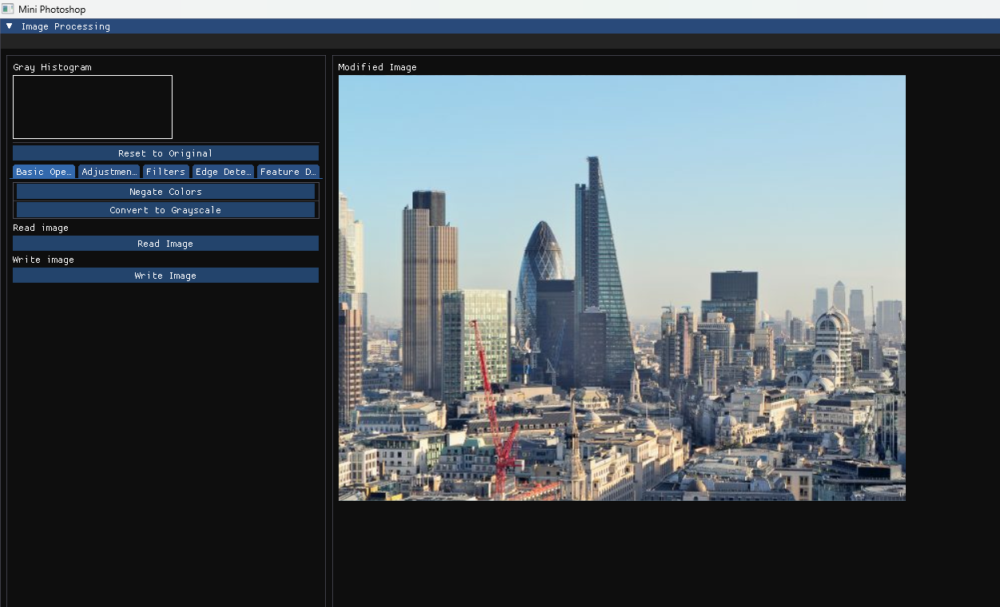
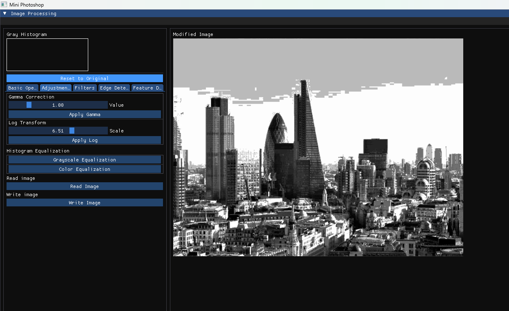
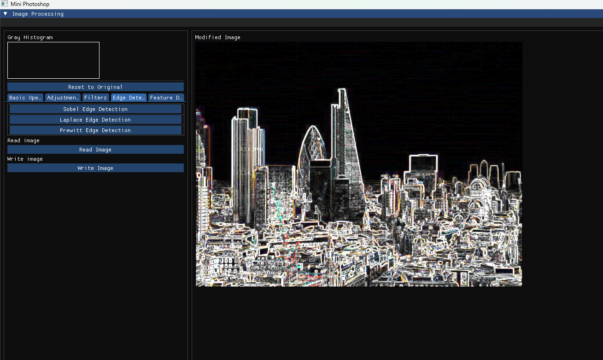

# Description

A Mini Photoshop app

## My Files
- main.cpp
- Shader.h
- Shader.cpp
- Texture.h
- Texture.cpp

## Algorithms
The Texture class contains the image processing algorithms.
OMP is used for optimizing the algorithms.

Supported algorithms
- Box Filter
- Gauss Filter
- Gamma Correction
- Logarithmic Transofmation
- Negate
- Gray Scaling
- Histogramm Equalizer (With and Without Colors)
- Sobel Edge detector
- Laplace Edge detector
- Prewitt Edge detector
- Harris Corner detector

## Further Features
- Load image
- Store modified image

## Used OpenGL tutorial for this project
https://learnopengl.com/
https://en.cppreference.com/w/cpp/17

## Previews

## Dependencies
- OpenGL
- [GLFW (64 bit)](https://www.glfw.org/download.html)
- [glad](https://glad.dav1d.de/)
- [ImGui](https://github.com/ocornut/imgui)
- [stb_image](https://github.com/nothings/stb/blob/master/stb_image.h)
- [stb_image_write](https://github.com/nothings/stb/blob/master/stb_image_write.h)
- [native file dialog](https://github.com/mlabbe/nativefiledialog/tree/master)

## Tested On
Windows 11 x64, with Visual Studio 2022, C++ 17
